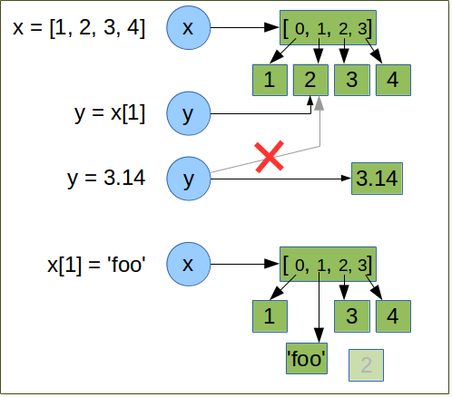
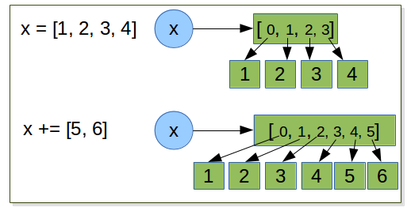
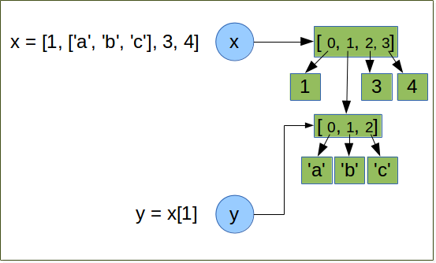
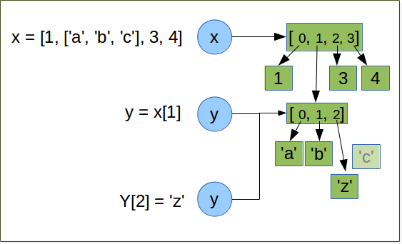

.. _Collection_Data_types:

*********************
Collection Data Types
*********************

Exercises
=========

Exercise
--------

| Draw the representation in memory of the following expressions.
| what is the data type of each object?

::   

   x = [1, 2, 3, 4]
   y = x[1]
   y = 3.14
   x[1] = 'foo'
   

   
::

   x = [1, 2, 3, 4]
   x += [5, 6]

::

   >>> x = [1, 2, 3, 4]
   >>> id(x)
   139950507563632
   >>> x += [5,6]
   >>> id(x)
   139950507563632
   

compare with the exercise on string and integers:

Since list are mutable, when ``+=`` is used the original list object is modified, so no rebinding of *x* is necessary.
We can observe this using *id()* which give the memory adress of an object. This adress does not change after the
``+=`` operation.

.. note::
   even the results is the same ther is a subtelty to use augmented operator.
   in ``a operator= b`` python looks up ``a`` ’s value only once, so it is potentially faster
   than the ``a = a operator b``.

Exercise
--------

wihout using python shell, what is the results of the following statements:  
 
.. note:: 
   sum is a function which return the sum of each elements of a list.
      
::
 
   x = [1, 2, 3, 4]
   x[3] = -4 # what is the value of x now ?
   y = sum(x)/len(x) #what is the value of y ? why ?
   
   y = 0

because sum(x) is an integer, len(x) is also an integer so in python2.x the result is an integer, 
all the digits after the periods are discarded.
In python3 we will obtain the expected result (see :ref:``) 
   
   
Exercise
--------

How to compute safely the average of a list? ::

   float(sum(l)) / float(len(l))

Exercise
--------

Draw the representation in memory of the following expressions. ::

   x = [1, ['a','b','c'], 3, 4]
   y = x[1]
   y[2] = 'z'
   # what is the value of x ?
   

   

.. container:: clearer

    .. image :: _static/figs/spacer.png
       
 When we execute *y = x[1]*, we create ``y`` wich reference the list ``['a', 'b', 'c']``.
 This list has 2 references on it: ``y`` and ``x[1]`` .
   
   

 
   
.. container:: clearer

    .. image :: _static/figs/spacer.png
       
   
 This object is a list so it is a mutable object.
 So we can access **and** modify it by the two ways ``y`` or ``x[1]`` ::
 
   x = [1, ['a','b','z'], 3, 4]
    
Exercise
--------

from the list l = [1, 2, 3, 4, 5, 6, 7, 8, 9] generate 2 lists l1 containing all odd values, and l2 all even values.::

   l = [1, 2, 3, 4, 5, 6, 7, 8, 9]
   l1 = l[::2]
   l2 = l[1::2]

    
Exercise
--------
   
generate a list containing all codons. ::
   
   bases = 'acgt'
   codons = []
      for a in bases:
         for b in bases:
            for c in bases:
               codon = a + b + c
               codons.append(codon)
               
Exercise
--------

From a list return a new list without any duplicate, regardless of the order of items. 
For example: ::

   >>> l = [5,2,3,2,2,3,5,1]
   >>> uniqify(l)
   >>> [1,2,3,5] #is one of the solutions 

solution ::

   >>> list(set(l))

Exercise
--------

let the following enzymes collection: ::
 
   import collections
   RestrictEnzyme = collections.namedtuple("RestrictEnzyme", "name comment sequence cut end")

   ecor1 = RestrictEnzyme("EcoRI", "Ecoli restriction enzime I", "gaattc", 1, "sticky")
   ecor5 = RestrictEnzyme("EcoRV", "Ecoli restriction enzime V", "gatatc", 3, "blunt")
   bamh1 = RestrictEnzyme("BamHI", "type II restriction endonuclease from Bacillus amyloliquefaciens ", "ggatcc", 1, "sticky")
   hind3 = RestrictEnzyme("HindIII", "type II site-specific nuclease from Haemophilus influenzae", "aagctt", 1 , "sticky")
   taq1 = RestrictEnzyme("TaqI", "Thermus aquaticus", "tcga", 1 , "sticky")
   not1 = RestrictEnzyme("NotI", "Nocardia otitidis", "gcggccgc", 2 , "sticky")
   sau3a1 = RestrictEnzyme("Sau3aI", "Staphylococcus aureus", "gatc", 0 , "sticky")
   hae3 = RestrictEnzyme("HaeIII", "Haemophilus aegyptius", "ggcc", 2 , "blunt")
   sma1 =  RestrictEnzyme("SmaI", "Serratia marcescens", "cccggg", 3 , "blunt")

and the 2 dna fragments: ::

   dna_1 = """tcgcgcaacgtcgcctacatctcaagattcagcgccgagatccccgggggttgagcgatccccgtcagttggcgtgaattcag
   cagcagcgcaccccgggcgtagaattccagttgcagataatagctgatttagttaacttggatcacagaagcttccaga
   ccaccgtatggatcccaacgcactgttacggatccaattcgtacgtttggggtgatttgattcccgctgcctgccagg"""

   dna_2 = """gagcatgagcggaattctgcatagcgcaagaatgcggccgcttagagcgatgctgccctaaactctatgcagcgggcgtgagg
   attcagtggcttcagaattcctcccgggagaagctgaatagtgaaacgattgaggtgttgtggtgaaccgagtaag
   agcagcttaaatcggagagaattccatttactggccagggtaagagttttggtaaatatatagtgatatctggcttg"""

| which enzymes cut the dna_1 ?
|                  the dna_2 ?
|                  the dna_1 but not the dna_2?

::

   dna_1 = dna_1.replace('\n', '')
   dans_2 = dna_2.replace('\n', '')

algorithm 1 ::

   enzymes = [ecor1, ecor5, bamh1, hind3, taq1, not1, sau3a1, hae3, sma1]
   digest_1 = []
   for enz in enzymes:
      if enz.sequence in dna_1:
         digest_1.append(enz)

algorithm 2 we can determine the position of the site :: 
   
   enzymes = [ecor1, ecor5, bamh1, hind3, taq1, not1, sau3a1, hae3, sma1]
   digest_1 = []
   for enz in enzymes:
      pos = dna_1.find(enz.sequence)
      if pos != -1:
         digest_1.append(enz)

with these algorithms we find if an enzyme cut the dna but we cannot find all cuts in the dna for an enzyme. ::

   enzymes = [ecor1, ecor5, bamh1, hind3, taq1, not1, sau3a1, hae3, sma1]
   digest_1 = []
   for enz in enzymes:
      print enz.name, dna_1.count(enz.sequence)

the latter algorithm display the number of occurence of each enzyme, But we cannot determine the position of every sites.
We will see howt to do this later.

Exercise
--------
From a list return a new list without any duplicate, but keeping the order of items. 
For example: ::

   >>> l = [5,2,3,2,2,3,5,1]
   >>> uniqify_with_order(l)
   >>> [5,2,3,1]  

solution ::

   >>> uniq = []
   >>> for item in l:
   >>>   if item not in uniq:
   >>>      uniq.append(item)

Exercise
--------

list and count occurences of every 3mers in the following sequence ::

   s = """gtcagaccttcctcctcagaagctcacagaaaaacacgctttctgaaagattccacactcaatgccaaaatataccacag
   gaaaattttgcaaggctcacggatttccagtgcaccactggctaaccaagtaggagcacctcttctactgccatgaaagg
   aaaccttcaaaccctaccactgagccattaactaccatcctgtttaagatctgaaaaacatgaagactgtattgctcctg
   atttgtcttctaggatctgctttcaccactccaaccgatccattgaactaccaatttggggcccatggacagaaaactgc
   agagaagcataaatatactcattctgaaatgccagaggaagagaacacagggtttgtaaacaaaggtgatgtgctgtctg
   gccacaggaccataaaagcagaggtaccggtactggatacacagaaggatgagccctgggcttccagaagacaaggacaa
   ggtgatggtgagcatcaaacaaaaaacagcctgaggagcattaacttccttactctgcacagtaatccagggttggcttc
   tgataaccaggaaagcaactctggcagcagcagggaacagcacagctctgagcaccaccagcccaggaggcacaggaaac
   acggcaacatggctggccagtgggctctgagaggagaaagtccagtggatgctcttggtctggttcgtgagcgcaacaca"""

and finally print the results one 3mer and it's occurence per line. 

write first the pseudocode, then implement it.

bonus:
print the kmer by incresing occurences.

solution ::

   s = s.replace('\n', '')
   kmers = {}
   # range exclude the last value range(3) -> 0, 1 ,2
   # so we nned to go to len(s) minus trimer + 1 to include the 
   # last base 
   for i in range(len(s) - 3 +1):
      kmer = s[i:i+3]
      kmers[kmer] = kmers.get(kmer, 0) + 1

   for kmer, occurence in kmers.items():
      print kmer, " = ", occurence

we can use also a defaultdict: ::

   import collections
   
   s = s.replace('\n', '')
   kmers = collection.defaultdict(int)
   for i in range(len(s) - 2):
      kmer = s[i:i+3]
      kmers[kmer] += 1

solution bonus ::

   list_of_kmers = kmers.items()  
   from operator import itemgetter
   list_of_kmers.sort(key=itemgetter(1)) 
   for kmer, occurence in list_of_kmers:
      print kmer, " = ", occurence

 solution bonus ::

   list_of_kmers = kmers.items()      
   list_of_kmers.sort(key = lambda kmer: kmer[1])
   for kmer, occurence in list_of_kmers:
      print kmer, " = ", occurence   
      
  
Exercise
--------

compute the reversed complement of the following sequence: ::

   seq = 'acggcaacatggctggccagtgggctctgagaggagaaagtccagtggatgctcttggtctggttcgtgagcgcaacaca'

   base_comp = { 'a' : 't', 
                 'c' : 'g',
                 'g' : 'c',
                 't' : 'a'}
   complement = ''
   for base in seq:
      complement += base_comp[base]

   reverse_comp = complement[::-1]
   print reverse_comp
   tgtgttgcgctcacgaaccagaccaagagcatccactggactttctcctctcagagcccactggccagccatgttgccgt
  
      
Exercise
--------

given the following dict : ::

   d = {1 : 'a', 2 : 'b', 3 : 'c' , 4 : 'd'}
   
We want obtain a new dict with the keys and the values inverted so we will obtain: ::

   inverted_d  {'a': 1, 'c': 3, 'b': 2, 'd': 4}

solution ::

   inverted_d = {}
   for key in d.keys():
       inverted_d[d[key]] = key
       
solution ::

   inverted_d = {}
   for key, value in d.items():
       inverted_d[value] = key
              
solution ::

   inverted_d = {v : k for k, v in d.items()}
   
Exercise
--------

We assume that we have a phylogenic tree of mammals represented as nested lists. ::
    
   mammals = ['Bovine', ['Gibbon', ['Orang Utan', ['Gorilla', ['Chimp', 'Human']]]], 'Mouse' ]
   
We want to work on the subtree of apes (Gibbon, Orang Utan, Gorilla, Chimp, Human) 

* extract the this subtree in a new tree
* then insert 'Bonobo' at the same level of Chimp we want to obtanin something like this :[chimp, bonobo], Human]
   
what's append on mammals? explain the result. ::

   import copy
     
   mammals = ['Bovine', ['Gibbon', ['Orang Utan', ['Gorilla', ['Chimp', 'Human']]]], 'Mouse' ]
   apes = copy.copy(mammals[1])
   apes [1][1][1] = [['Chimp', 'Bonobo'], 'Human']
   print mammals
   ['Bovine', ['Gibbon', ['Orang Utan', ['Gorilla', ['Chimp', 'Human']]]], 'Mouse' ]

what we should do to work with apes without modify mammals?
   
when we extract apes form mammals we did a shallow copy of mammals. tha mean we create a new list but each item in mammals 
are not copy. when we modify apes we mutate an element of apes which was also referenced in mammals so mammals is modified to.
This is what we call a side effect. To avoid that we should use deepcopy from module copy.
to create apes we should write: ::

   apes = copy.deepcopy(mammals[1]) 
   
deepcopy not only copy the list but make also a copy of each items of list recursively.
 
