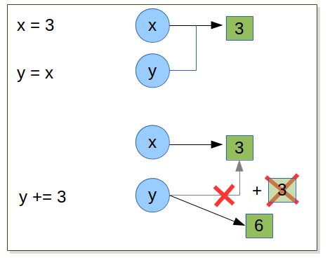
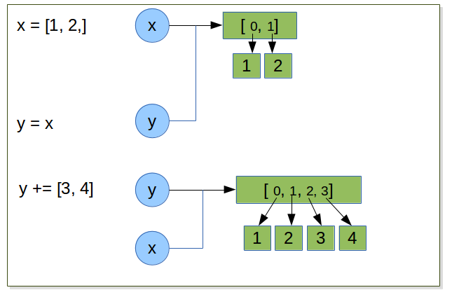

.. _Collection_Data_types:

*********************
Collection Data Types
*********************

Exercises
=========

Exercise
--------

| Draw the representation in memory of the following expressions.
| what is the data type of each object?

::   

   x = [1, 2, 3, 4]
   y = x[1]
   y = 3.14
   x[1] = 'foo'
   
.. figure:: _static/figs/list_1.png
   :width: 400px
   :alt: set
   :figclass: align-center
   
::

   x = [1, 2, 3, 4]
   x += [5, 6]

.. figure:: _static/figs/augmented_assignment_list.png  
   :width: 400px
   :alt: set
   :figclass: align-center 

::

   >>> x = [1, 2, 3, 4]
   >>> id(x)
   139950507563632
   >>> x += [5,6]
   >>> id(x)
   139950507563632
   
With mutable object like ``list`` when we mutate the object the state of the object is modified.
But the reference to the object is still unchanged.
So in this exemple we have two ways to access to the list [1,2] if we modify the state of the list itself.
but not the references to this object, then the 2 variables x and y still reference the list containing
[1,2,3,4]. 

compare with the exercise on string and integers:

Since list are mutable, when ``+=`` is used the original list object is modified, so no rebinding of *x* is necessary.
We can observe this using *id()* which give the memory adress of an object. This adress does not change after the
``+=`` operation.

.. note::
   even the results is the same there is a subtelty to use augmented operator.
   in ``a operator= b`` python looks up ``a`` ’s value only once, so it is potentially faster
   than the ``a = a operator b``.

compare ::

   x = 3
   y = x
   y += 3
   x = ?
   y = ?
   
   

   
and ::

   x = [1,2]
   y = x
   y += [3,4]
   x = ?
   y = ?  

Exercise
--------

wihout using python shell, what is the results of the following statements:  
 
.. note:: 
   sum is a function which return the sum of each elements of a list.
      
::
 
   x = [1, 2, 3, 4]
   x[3] = -4 # what is the value of x now ?
   y = sum(x)/len(x) #what is the value of y ? why ?
   
   y = 0

because sum(x) is an integer, len(x) is also an integer so in python2.x the result is an integer, 
all the digits after the periods are discarded.
In python3 we will obtain the expected result (see :ref:``) 
   
   
Exercise
--------

How to compute safely the average of a list? ::

   float(sum(l)) / float(len(l))

Exercise
--------

Draw the representation in memory of the following expressions. ::

   x = [1, ['a','b','c'], 3, 4]
   y = x[1]
   y[2] = 'z'
   # what is the value of x ?
   
.. figure:: _static/figs/list_2-1.png
   :width: 400px
   :alt: set
   :figclass: align-center
   

.. container:: clearer

    .. image :: _static/figs/spacer.png
       
 When we execute *y = x[1]*, we create ``y`` wich reference the list ``['a', 'b', 'c']``.
 This list has 2 references on it: ``y`` and ``x[1]`` .
   
   
.. figure:: _static/figs/list_2-2.png
   :width: 400px
   :alt: set
   :figclass: align-center
 
   
.. container:: clearer

    .. image :: _static/figs/spacer.png
       
   
 This object is a list so it is a mutable object.
 So we can access **and** modify it by the two ways ``y`` or ``x[1]`` ::
 
   x = [1, ['a','b','z'], 3, 4]
    
Exercise
--------

from the list l = [1, 2, 3, 4, 5, 6, 7, 8, 9] generate 2 lists l1 containing all odd values, and l2 all even values.::

   l = [1, 2, 3, 4, 5, 6, 7, 8, 9]
   l1 = l[::2]
   l2 = l[1::2]

    
Exercise
--------
   
generate a list containing all codons.
   
pseudocode:
"""""""""""

| *function all_codons()*
|     *all_codons <- empty list*
|     *let varying the first base*
|     *for each first base let varying the second base*
|     *for each combination first base, second base let varying the third base*
|     *add the concatenation base 1 base 2 base 3 to all_codons*
|     *return all_codons*

first implementation:
"""""""""""""""""""""
.. literalinclude:: _static/code/codons.py
   :linenos:
   :language: python

::

   python -i codons.py 
   >>> codons = all_codons()
   
:download:`codons.py <_static/code/codons.py>` .  

second implementation:
""""""""""""""""""""""

Mathematically speaking the generation of all codons can be the cartesiens product 
between 3 vectors 'acgt'. 
In python there is a function to do that in ``itertools module``: `https://docs.python.org/2/library/itertools.html#itertools.product <product>`_

.. literalinclude:: _static/code/codons_itertools.py
   :linenos:
   :language: python

::

   python -i codons.py 
   >>> codons = all_codons()
   
:download:`codons_itertools.py <_static/code/codons_itertools.py>` .

               
Exercise
--------

From a list return a new list without any duplicate, regardless of the order of items. 
For example: ::

   >>> l = [5,2,3,2,2,3,5,1]
   >>> uniqify(l)
   >>> [1,2,3,5] #is one of the solutions 

pseudocode:
"""""""""""

| *function uniqify(l)*
|     *uniq <- empty list*
|     *for each element of l*
|        *add element if is not in uniq*
|     *return uniq*

implementation:
"""""""""""""""

.. literalinclude:: _static/code/uniqify.py
   :linenos:
   :language: python

::

   >>> l=[1,2,3,2,3,4,5,1,2,3,3,2,7,8,9]
   >>> uniqify(l)
   [1, 2, 3, 4, 5, 7, 8, 9]

:download:`codons_itertools.py <_static/code/codons_itertools.py>` .

second implementation:
""""""""""""""""""""""

The problem with the first implementation come from the line 4.
Remember that the membership operator uses a linear search for list, which can be slow for very large collections.
If we plan to use ``uniqify`` with large list we should find a better algorithm.
In the specification we can read that uniqify can work *regardless the order of the resulting list*.
So we can use the specifycity of set ::

 
   >>> list(set(l))

Exercise
--------

We need to compute the occurence of all kmers of a given lenght present in a sequence.

Below we propose 2 algorithms. 

pseudo code 1
"""""""""""""

|   *function get_kmer_occurences(seq, kmer_len)*
|      *all_kmers <- generate all possible kmer of kmer_len*
|      *occurences <- 0* 
|      *for each kmer in all_kmers*
|         *count occurence of kmer*
|         *store occurence*
     
pseudo code 2
"""""""""""""

|  *function get_kmer_occurences(seq, kmer_len)*
|     *all_kmers <- empty*
|     *from i = 0 to sequence length - kmer_len*
|        *kmer <- kmer startin at pos i im sequence*
|        *increase by of occurence of kmer*
 

.. note::

   Computer scientists typically measure an algorithm’s efficiency in terms of its worst-case running time, 
   which is the largest amount of time an algorithm can take given the most difficult input of a fixed size. 
   The advantage to considering the worst case running time is that we are guaranteed that our algorithm 
   will never behave worse than our worst-case estimate.
   
   Big-O notation compactly describes the running time of an algorithm. 
   For example, if your algorithm for sorting an array of n numbers takes roughly n2 operations for the most difficult dataset, 
   then we say that the running time of your algorithm is O(n2). In reality, depending on your implementation, it may be use any number of operations, 
   such as 1.5n2, n2 + n + 2, or 0.5n2 + 1; all these algorithms are O(n2) because big-O notation only cares about the term that grows the fastest with 
   respect to the size of the input. This is because as n grows very large, the difference in behavior between two O(n2) functions, 
   like 999 · n2 and n2 + 3n + 9999999, is negligible when compared to the behavior of functions from different classes, 
   say O(n2) and O(n6). Of course, we would prefer an algorithm requiring 1/2 · n2 steps to an algorithm requiring 1000 · n2 steps.

   When we write that the running time of an algorithm is O(n2), we technically mean that it does not grow faster than a function with a 
   leading term of c · n2, for some constant c. Formally, a function f(n) is Big-O of function g(n), or O(g(n)), when f(n) ≤ c · g(n) for some 
   constant c and sufficiently large n.

   For more on Big-O notation, see A `http://rob-bell.net/2009/06/a-beginners-guide-to-big-o-notation/Beginner's <Guide to Big-O Notation>`_.
   

Compare the pseudocode of each of them and implement the fastest one. ::

   """gtcagaccttcctcctcagaagctcacagaaaaacacgctttctgaaagattccacactcaatgccaaaatataccacag
      gaaaattttgcaaggctcacggatttccagtgcaccactggctaaccaagtaggagcacctcttctactgccatgaaagg
      aaaccttcaaaccctaccactgagccattaactaccatcctgtttaagatctgaaaaacatgaagactgtattgctcctg
      atttgtcttctaggatctgctttcaccactccaaccgatccattgaactaccaatttggggcccatggacagaaaactgc
      agagaagcataaatatactcattctgaaatgccagaggaagagaacacagggtttgtaaacaaaggtgatgtgctgtctg
      gccacaggaccataaaagcagaggtaccggtactggatacacagaaggatgagccctgggcttccagaagacaaggacaa
      ggtgatggtgagcatcaaacaaaaaacagcctgaggagcattaacttccttactctgcacagtaatccagggttggcttc
      tgataaccaggaaagcaactctggcagcagcagggaacagcacagctctgagcaccaccagcccaggaggcacaggaaac
      acggcaacatggctggccagtgggctctgagaggagaaagtccagtggatgctcttggtctggttcgtgagcgcaacaca"""

In the first alogrithm. 

| we first compute all kmers we generate 4\ :sup:`kmer length`
| then we count the occurence of each kmer in the sequence
| so for each kmer we read all the sequence so the algorith is in O( 4\ :sup:`kmer length` * ``sequence length``) 

| In the secon algorithm we read the sequence only once 
| So the algorithm is in O(sequence length)

Compute the 6 mers occurences of the sequence above, and print each 6mer and it's occurence one per line.

.. literalinclude:: _static/code/kmer.py
   :linenos:
   :language: python

::

   >>> s = """"gtcagaccttcctcctcagaagctcacagaaaaacacgctttctgaaagattccacactcaatgccaaaatataccacag
   ... gaaaattttgcaaggctcacggatttccagtgcaccactggctaaccaagtaggagcacctcttctactgccatgaaagg
   ... aaaccttcaaaccctaccactgagccattaactaccatcctgtttaagatctgaaaaacatgaagactgtattgctcctg
   ... atttgtcttctaggatctgctttcaccactccaaccgatccattgaactaccaatttggggcccatggacagaaaactgc
   ... agagaagcataaatatactcattctgaaatgccagaggaagagaacacagggtttgtaaacaaaggtgatgtgctgtctg
   ... gccacaggaccataaaagcagaggtaccggtactggatacacagaaggatgagccctgggcttccagaagacaaggacaa
   ... ggtgatggtgagcatcaaacaaaaaacagcctgaggagcattaacttccttactctgcacagtaatccagggttggcttc
   ... tgataaccaggaaagcaactctggcagcagcagggaacagcacagctctgagcaccaccagcccaggaggcacaggaaac
   ... acggcaacatggctggccagtgggctctgagaggagaaagtccagtggatgctcttggtctggttcgtgagcgcaacaca"""
   >>> s = s.replace('\n', '')
   >>> kmers = get_kmer_occurences(s, 6)
   >>> for kmer in kmers:
   >>>   print kmer[0], '..', kmer[1]
   gcagag .. 2
   aacttc .. 1
   gcaact .. 1
   aaatat .. 2
   
   
:download:`kmer.py <_static/code/kmer.py>` .

bonus:
""""""

Print the kmers by ordered by occurences.

| see `https://docs.python.org/2/library/stdtypes.html#mutable-sequence-types <sort>`_
| see `https://docs.python.org/2/library/operator.html#operator.itemgetter <operator.itemgetter>`_

.. literalinclude:: _static/code/kmer_2.py
   :linenos:
   :language: python

::

   >>> s = """"gtcagaccttcctcctcagaagctcacagaaaaacacgctttctgaaagattccacactcaatgccaaaatataccacag
   ... gaaaattttgcaaggctcacggatttccagtgcaccactggctaaccaagtaggagcacctcttctactgccatgaaagg
   ... aaaccttcaaaccctaccactgagccattaactaccatcctgtttaagatctgaaaaacatgaagactgtattgctcctg
   ... atttgtcttctaggatctgctttcaccactccaaccgatccattgaactaccaatttggggcccatggacagaaaactgc
   ... agagaagcataaatatactcattctgaaatgccagaggaagagaacacagggtttgtaaacaaaggtgatgtgctgtctg
   ... gccacaggaccataaaagcagaggtaccggtactggatacacagaaggatgagccctgggcttccagaagacaaggacaa
   ... ggtgatggtgagcatcaaacaaaaaacagcctgaggagcattaacttccttactctgcacagtaatccagggttggcttc
   ... tgataaccaggaaagcaactctggcagcagcagggaacagcacagctctgagcaccaccagcccaggaggcacaggaaac
   ... acggcaacatggctggccagtgggctctgagaggagaaagtccagtggatgctcttggtctggttcgtgagcgcaacaca"""
   >>> s = s.replace('\n', '')
   >>> kmers = get_kmer_occurences(s, 6)
   >>> for kmer, occ in kmers:
   >>>   print kmer, '..', occ
   cacagg .. 4
   aggaaa .. 4
   ttctga .. 3
   ccagtg .. 3
   
   
:download:`kmer_2.py <_static/code/kmer_2.py>` .

Exercise
--------

| Write a function which take a sequence as parameter and return it's reversed complement.
| Write the pseudocode before to propose an implementation.

pseudocode:
"""""""""""

| *function reverse_comp(sequence)*
|     *complement <- establish a correpondance and each base and its complement*
|     *rev_seq <- revert the sequence*
|     *rev_comp <- empty*
|     *for each nt of rev_seq*
|        *concatenate nt complement to rev_comp*
|     *return rev_comp

.. literalinclude:: _static/code/rev_comp2.py
   :linenos:
   :language: python

::
   >>> from rev_comp import rev_comp
   >>>
   >>> seq = 'acggcaacatggctggccagtgggctctgagaggagaaagtccagtggatgctcttggtctggttcgtgagcgcaacaca'
   >>> print rev_comp(seq)
   tgtgttgcgctcacgaaccagaccaagagcatccactggactttctcctctcagagcccactggccagccatgttgccgt
   
:download:`rev_comp.py <_static/code/rev_comp.py>` .

  
other solution
""""""""""""""

python provide an interresting method for our problem. 
The ``translate`` method work on string and need a parameter which is a object
that can do the correspondance between characters in old string a the new one.
``maketrans`` is a function in module ``string`` that allow us to build this object.
``maketrans`` take 2 arguments, two strings, the first string contains the characters
to change, the second string the corresponding characters in the new string.
Thus the two strings **must** have the same lenght. The correspondance between
the characters to change and their new values is made in funtion of thier position.
the first character of the first string will be replaced by the first character of the second string,
the second character of the first string will be replaced by the second character of the second string, on so on.   
So we can write the reverse complement without loop.
   
.. literalinclude:: _static/code/rev_comp2.py
   :linenos:
   :language: python

::
   >>> from rev_comp2 import rev_comp
   >>>
   >>> seq = 'acggcaacatggctggccagtgggctctgagaggagaaagtccagtggatgctcttggtctggttcgtgagcgcaacaca'
   >>> print rev_comp(seq)
   tgtgttgcgctcacgaaccagaccaagagcatccactggactttctcctctcagagcccactggccagccatgttgccgt
   
:download:`rev_comp2.py <_static/code/rev_comp2.py>` .

Exercise
--------

let the following enzymes collection: ::
 
   import collections
   RestrictEnzyme = collections.namedtuple("RestrictEnzyme", "name comment sequence cut end")

   ecor1 = RestrictEnzyme("EcoRI", "Ecoli restriction enzime I", "gaattc", 1, "sticky")
   ecor5 = RestrictEnzyme("EcoRV", "Ecoli restriction enzime V", "gatatc", 3, "blunt")
   bamh1 = RestrictEnzyme("BamHI", "type II restriction endonuclease from Bacillus amyloliquefaciens ", "ggatcc", 1, "sticky")
   hind3 = RestrictEnzyme("HindIII", "type II site-specific nuclease from Haemophilus influenzae", "aagctt", 1 , "sticky")
   taq1 = RestrictEnzyme("TaqI", "Thermus aquaticus", "tcga", 1 , "sticky")
   not1 = RestrictEnzyme("NotI", "Nocardia otitidis", "gcggccgc", 2 , "sticky")
   sau3a1 = RestrictEnzyme("Sau3aI", "Staphylococcus aureus", "gatc", 0 , "sticky")
   hae3 = RestrictEnzyme("HaeIII", "Haemophilus aegyptius", "ggcc", 2 , "blunt")
   sma1 =  RestrictEnzyme("SmaI", "Serratia marcescens", "cccggg", 3 , "blunt")

and the 2 dna fragments: ::

   dna_1 = """tcgcgcaacgtcgcctacatctcaagattcagcgccgagatccccgggggttgagcgatccccgtcagttggcgtgaattcag
   cagcagcgcaccccgggcgtagaattccagttgcagataatagctgatttagttaacttggatcacagaagcttccaga
   ccaccgtatggatcccaacgcactgttacggatccaattcgtacgtttggggtgatttgattcccgctgcctgccagg"""

   dna_2 = """gagcatgagcggaattctgcatagcgcaagaatgcggccgcttagagcgatgctgccctaaactctatgcagcgggcgtgagg
   attcagtggcttcagaattcctcccgggagaagctgaatagtgaaacgattgaggtgttgtggtgaaccgagtaag
   agcagcttaaatcggagagaattccatttactggccagggtaagagttttggtaaatatatagtgatatctggcttg"""

| which enzymes cut the dna_1 ?
|                  the dna_2 ?
|                  the dna_1 but not the dna_2?

#. Write a function *seq_one_line* which take a multi lines sequence and return a sequence in one line.
#. Write a function *enz_filter* which take a sequence and a list of enzymes and return a new list containing 
   the enzymes which are a binding site in the sequence
#. use the functions above to compute the enzymes which cut the dna_1 
   apply the same functions to compute the enzymes which cut the dna_2
   compute the difference between the enzymes which cut the dna_1 and enzymes which cut the dna_2
   
.. literalinclude:: _static/code/enzymes_1.py
   :linenos:
   :language: python

::
   from enzyme_1 import *
   
   enzymes = [ecor1, ecor5, bamh1, hind3, taq1, not1, sau3a1, hae3, sma1]
   dna_1 = one_line(dna_1)
   dans_2 = one_line(dna_2)
   enz_1 = enz_filter(enzymes, dna_1)
   enz_2 = enz_filter(enzymes, dna_2) 
   enz1_only = set(enz_1) - set(enz_2)

:download:`enzymes_1.py <_static/code/enzymes_1.py>` .

with this algorithm we find if an enzyme cut the dna but we cannot find all cuts in the dna for an enzyme. ::

   enzymes = [ecor1, ecor5, bamh1, hind3, taq1, not1, sau3a1, hae3, sma1]
   digest_1 = []
   for enz in enzymes:
      print enz.name, dna_1.count(enz.sequence)

the latter algorithm display the number of occurence of each enzyme, But we cannot determine the position of every sites.
We will see how to do this later.

      
Exercise
--------

given the following dict : ::

   d = {1 : 'a', 2 : 'b', 3 : 'c' , 4 : 'd'}
   
We want obtain a new dict with the keys and the values inverted so we will obtain: ::

   inverted_d  {'a': 1, 'c': 3, 'b': 2, 'd': 4}

solution ::

   inverted_d = {}
   for key in d.keys():
       inverted_d[d[key]] = key
       
solution ::

   inverted_d = {}
   for key, value in d.items():
       inverted_d[value] = key
              
solution ::

   inverted_d = {v : k for k, v in d.items()}
   
