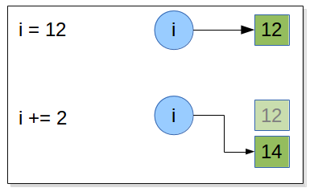
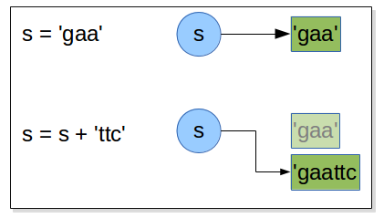

.. sectnum::
   :start: 4
   
.. _Data_Types:

**********
Data Types
**********

Exercices
=========

Exercise
--------

Assume that we execute the following assignment statements: ::

   width = 17
   height = 12.0
   delimiter ='.'

For each of the following expressions, write the value of the expression and the type (of the value of
the expression) and explain. 

 #. width / 2
 #. width / 2.0
 #. height / 3
 #. 1 + 2 * 5
   
Use the Python interpreter to check your answers. ::

   >>> width = 17
   >>> height = 12.0
   >>> delimiter ='.'
   >>> 
   >>> width / 2
   8
   >>> # both operands are integer so python done an euclidian division and threw out the remainder
   >>> width / 2.0
   8.5
   >>> height / 3
   4.0
   >>> # one of the operand is a float (2.0 or height) then python pyhton perform afloat  division but keep in mind that float numbers are aproximation.
   >>> # if you need precision you need to use Decimal. But operations on Decimal are slow and float offer quite enought precision
   >>> # so we use decimal only if wee need great precision
   >>> # Euclidian division
   >>> 2 / 3
   0
   >>> # float division
   >>> float(2)/float(3)
   0.6666666666666666
   >>> # decimal division
   >>> from decimal import Decimal
   >>> a = Decimal(2)
   >>> b = Decimal(3)
   >>> a / b
   Decimal('0.6666666666666666666666666667')
   >>> 1 + 2 * 5
   11

Exercise
--------

Write a function which take a radius as input and return the volume of a sphere:

The volume of a sphere with radius r is 4/3 πr\ :sup:`3`. 

What is the volume of a sphere with radius 5?

**Hint**: π is in math module, so to access it you need to import the math module 
Place the ``import`` statement at the top fo your file.
after that, you can use ``math.pi`` everywhere in the file like this::
      
      >>> import math
      >>>
      >>> #do what you need to do
      >>> math.pi #use math.pi
   
**Hint**: the volume of a spher with radius 5 is **not** 392.7 !
   
.. literalinclude:: _static/code/vol_of_sphere.py
   :linenos:
   :language: python

::

   python -i volume_of_sphere.py 
   >>> vol_of_sphere(5)
   523.5987755982989
   
:download:`vol_of_sphere.py <_static/code/vol_of_sphere.py>` .      

Exercise
--------

Draw what happen in memory when the following statements are executed: ::

   i = 12
   i += 2
   

   
::      

   >>> i = 12
   >>> id(i)
   33157200
   >>> i += 2
   >>> id(i)
   33157152

and ::

   s = 'gaa'
   s = s + 'ttc' 
   

::   

   >>> s = 'gaa'
   >>> id(s)
   139950507582368
   >>> s = s+ 'ttc'
   >>> s
   'gaattc'
   >>> id(s)
   139950571818896
   
when an augmented assignment operator is used on an immutable object is that 
 
#. the operation is performed, 
#. and an object holding the result is created  
#. and then the target object reference is re-bound to refer to the
   result object rather than the object it referred to before. 

So, in the preceding case when the statement ``i += 2`` is encountered, Python computes 1 + 2 , stores
the result in a new int object, and then rebinds ``i`` to refer to this new int . And
if the original object a was referring to has no more object references referring
to it, it will be scheduled for garbage collection. The same mechanism is done with all immutable object included strings.
  
Exercise
--------

how to obtain a new sequence which is the 10 times repetition of the this motif : "AGGTCGACCAGATTANTCCG"::
   >>> s = "AGGTCGACCAGATTANTCCG"
   >>> s10 = s * 10

Exercise
--------

create a representation in fasta format of following sequence :

.. note::
   A sequence in FASTA format begins with a single-line description, followed by lines of sequence data. 
   The description line is distinguished from the sequence data by a greater-than (">") symbol in the first column. 
   The word following the ">" symbol is the identifier of the sequence, and the rest of the line is the description (optional). 
   There should be no space between the ">" and the first letter of the identifier. 
   The sequence ends if another line starting with a ">" appears; this indicates the start of another sequence. 

::

   id = "sp|P60568|IL2_HUMAN"

   comment = "Interleukin-2 OS=Homo sapiens GN=IL2 PE=1 SV=1"

   sequence = """MYRMQLLSCIALSLALVTNSAPTSSSTKKTQLQLEHLLLDLQMILNGINNYKNPKLTRML
   TFKFYMPKKATELKHLQCLEEELKPLEEVLNLAQSKNFHLRPRDLISNINVIVLELKGSE
   TTFMCEYADETATIVEFLNRWITFCQSIISTLT"""

   >>> s = id + comment + '\n' + sequence
   or
   >>> s = "{id} {comment} \n{sequence}".format(id= id, comment = comment, sequence = sequence)   
   
   
Exercise
--------

For the following exercise use the python file :download:`sv40 in fasta <_static/code/sv40_file.py>` which is a python file with the sequence of sv40 in fasta format
already embeded, and use python -i sv40_file.py to work.

how long is the sv40 in bp? 
Hint : the fasta header is 61bp long.
(http://www.ncbi.nlm.nih.gov/nuccore/J02400.1)

pseudocode

write a function ``fasta_to_one_line`` that return a sequence as a string
without header or any non sequence characters

pseudocode:

|   *function fasta_to_one_line(seq)*
|      *header_end_at <- find the first return line character*
|      *raw_seq <- remove header from sequence*
|      *raw_seq <- remove non sequence chars*
|      *return raw_seq*

.. literalinclude:: _static/code/fasta_to_one_line.py
   :linenos:
   :language: python

   
:download:`fasta_to_one_line.py <_static/code/fasta_to_one_line.py>` . 

::

   python
   >>> import sv40_file
   >>> import fasta_to_one_line
   >>>
   >>> sv40_seq = fasta_to_one_line(sv40_file.sv40_fasta) 
   >>> print len(sv40_seq)
   5243

Is that the following enzymes: 

* BamHI (ggatcc), 
* EcorI (gaattc), 
* HindIII (aagctt), 
* SmaI (cccggg) 

have recogition sites in sv40 (just answer by True or False)? ::

   >>> "ggatcc".upper() in sv40_sequence
   True
   >>> "gaattc".upper() in sv40_sequence
   True
   >>> "aagctt".upper() in sv40_sequence
   True
   >>> "cccggg".upper() in sv40_sequence
   False

for the enzymes which have a recognition site can you give their positions? ::

   >>> sv40_sequence = sv40_sequence.lower()
   >>> sv40_sequence.find("ggatcc")
   2532
   >>> # remind the string are numbered from 0
   >>> 2532 + 1 = 2533 
   >>> # the recognition motif of BamHI start at 2533
   >>> sv40_sequence.find("gaattc")
   1781
   >>> # EcorI -> 1782
   >>> sv40_sequence.find("aagctt")
   1045
   >>> # HindIII -> 1046
   
is there only one site in sv40 per enzyme? 

The ``find`` method give the index of the first occurence or -1 if the substring is not found.
So we can not determine the occurence of a site only with the find method.
We will see how to do that when we learn looping and conditions. 

Exercise
--------

We want to perform a PCR on sv40, can you give the length and the sequence of the amplicon?

Write a function which have 3 parameters ``sequence``, ``primer_1`` and ``primer_2``

* *We consider only the cases where primer_1 and primer_2 are present in sequence* 
* *to simplify the exercise, the 2 primers can be read directly in the sv40 sequence.*

test you algorithm with the following primers 

| primer_1 : 5' CGGGACTATGGTTGCTGACT 3'
| primre_2 : 5' TCTTTCCGCCTCAGAAGGTA 3'

Write the pseudocode before to implement it.

| *function amplicon_len(sequence primer_1, primer_2)*
|      *pos_1 <- find position of primer_1 in sequence*
|      *pos_2 <- find position of primer_2 in sequence*
|      *amplicon length <- pos_2 + length(primer_2) - pos_1*
|      *return amplicon length* 

.. literalinclude:: _static/code/amplicon_len.py
   :linenos:
   :language: python

::

   >>> import sv40 
   >>> import fasta_to_one_line
   >>> 
   >>> sequence = fasta_to_one_line(sv40)
   >>> print amplicon_len(sequence, first_primer, second_primer )
   199
   
:download:`amplicon_len.py <_static/code/amplicon_len.py>` . 

Exercise
--------

reverse the following sequence "TACCTTCTGAGGCGGAAAGA" (don't compute the complement): ::

   >>> "TACCTTCTGAGGCGGAAAGA"[::-1]
   or 
   >>> s = "TACCTTCTGAGGCGGAAAGA"
   >>> l = list(s) 
   # take care reverse() reverse a list in place (the method do a side effect and return None ) 
   # so if you don't have a obect reference on the list you cannot get the reversed list! 
   >>> l.reverse()
   >>> print l
   >>> ''.join(l)
   or 
   >>> rev_s  = reversed(s)
   ''.join(rev_s)
 
 The most efficient way to reverse a string or a list is the way using the slice. 

Exercise
--------

| The il2_human contains 4 cysteins (C) in positions 9, 78, 125, 145. 
| We want to generate the sequence of a mutatnt were the cysteins 78 and 125 are replaced by serins (S)
| Write the pseudocode, before to propose an implementation:

We have to take care of the string numbered vs sequence numbered:

| C in seq -> in string
|     9 -> 8
|    78 -> 77
|   125 -> 124
|   145 -> 144

| *generate 3 slices from the il2_human*
| *head <- from the begining and cut between the first cytein and the second* 
| *body <- include  the 2nd and 3rd cystein*
| *tail <- cut after the 3rd cystein until the end* 
| *replace body cystein by serin* 
| *make new sequence with head body_mutate tail*
  
il2_human = 
'MYRMQLLSCIALSLALVTNSAPTSSSTKKTQLQLEHLLLDLQMILNGINNYKNPKLTRMLTFKFYMPKKATELKHLQCLEEELKPLEEVLNLAQSKNFHLRPRDLISNINVIVLELKGSETTFMCEYADETATIVEFLNRWITFCQSIISTLT'
  
  
::

   head = il2_human[:77]
   body = il2_human[77:125]
   tail = il2_human[126:]
   body_mutate = body.replace('C', 'S')
   il2_mutate = head + body_mutate + tail

Exercise
--------

Write a function 

* which take a sequence as paramter
* compute the GC%
* and return it
* display the results readable for human as a micro report like this:
  'the sv40 is 5243 bp length and have 40.80% gc' 
  
use sv40 sequence to test your function.

.. literalinclude:: _static/code/gc_percent.py
   :linenos:
   :language: python

::

   >>> import sv40 
   >>> import fasta_to_one_line
   >>> import gc_percent
   >>> 
   >>> sequence = fasta_to_one_line(sv40)
   >>> gc_pc = gc_percent(sequence)
   >>> report = the sv40 is {0} bp length and have {1:.2%} gc".format(len(sequence), gc_pc)
   >>> print report
   'the sv40 is 5243 bp length and have 40.80% gc'
   
:download:`gc_percent.py <_static/code/gc_percent.py>` . 

::

   gc_pc =  float(sv40_sequence.count('g') + sv40_sequence.count('c')) / float(len(sv40_sequence))
   "the sv40 is {0} bp lenght and have {1:.2%} gc".format(len(sv40), gc_pc)