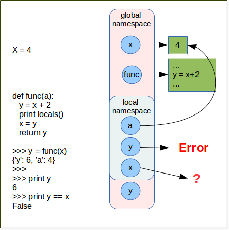
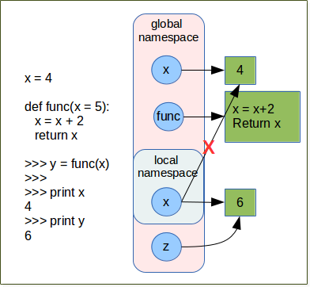
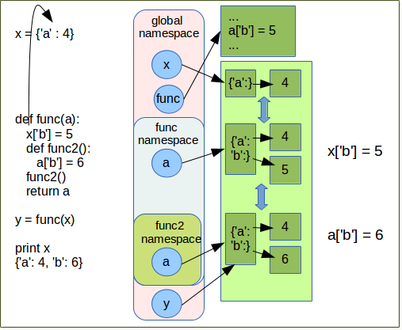

.. sectnum::
   :start: 8

.. _Dive_into_Functions:

*******************
Dive into Functions
*******************

Exercises
=========

Exercise
--------

Without executing the code in Python interpreter, can you determine what the code below print out. 
help you by drawing diagram.

**Hint** locals print a dictionary with local variable as keys and their respective values.

.. code-block:: python

   x = 4 
   
   def func():
      y  = 5
      print locals()
    
   >>> func()
   {'y': 5}
   >>> print x
   4

.. container:: clearer

   .. image :: _static/figs/spacer.png   
       
Exercise
--------

   
Without executing the code in Python interpreter, can you determine what the code below print out. 
help you by drawing diagram.

**Hint** locals print a dictionary with local variable as keys and their respective values.

.. code-block:: python

   x = 4 
   
   def func():
      y = 5 
      x = 8
      print locals()
      x = x + 2
   
   >>> y = func()
   {'y': 5, 'x': 8}
   >>> 
   >>> print y
   None
   >>> print x
   4

.. container:: clearer

   .. image :: _static/figs/spacer.png   
    
       
Exercise
--------

Without executing the code in Python interpreter, can you determine what the code below print out. 
help you by drawing diagram.

**Hint** locals print a dictionary with local variable as keys and their respective values.

.. code-block:: python

   x = 4
   
   def func(a):
      y = x + 2 
      print locals()
      x = y
      return y
      
   >>> y = func(x)    
   Traceback (most recent call last):
     File "<stdin>", line 1, in <module>
     File "<stdin>", line 2, in func
   UnboundLocalError: local variable 'x' referenced before assignment  

Unlike what we might think in *y = x + 2* *x* is not get from the global scope.
As soon as you make an assignment to a variable in a scope, 
that variable becomes local to that scope and shadows any similarly named variable in the outer scope.
even if the assignment appear later in code.
Here *x = y* make *x* as local variable whatever you are in func.
so at line  *y = x + 2* we try to use the local variable *x* but we have to asign it a value (it is done later) so
Python raise an UnboundLocalError (`see python faq for details <https://docs.python.org/3/faq/programming.html#why-am-i-getting-an-unboundlocalerror-when-the-variable-has-a-value>`_) 

.. container:: clearer

   .. image :: _static/figs/spacer.png   
    

Exercise
--------

Without executing the code in Python interpreter, can you determine what the code below print out. 
help you by drawing diagram.

**Hint** locals print a dictionary with local variable as keys and their respective values.

.. code-block:: python

   x = 4
   
   def func(a):
      x = x + 2 
      print locals()
      return x
       
   y = func(x)
   Traceback (most recent call last):
     File "<stdin>", line 1, in <module>
     File "<stdin>", line 2, in func
   UnboundLocalError: local variable 'x' referenced before assignment
   
   print y
   print y == x     

.. container:: clearer

   .. image :: _static/figs/spacer.png   
    

Exercice
--------

Without executing the code in Python interpreter, can you determine what the code below print out. 
help you by drawing diagram.

.. code-block:: python

   x = 4
   
   def func(x):
      x = x + 2 
      return x
       
   y = func(x)

   >>> print x
   4
   >>> print y == x
   False
   
.. container:: clearer

   .. image :: _static/figs/spacer.png   
    
    
Exercice
--------

Without executing the code in Python interpreter, can you determine what the code below print out. 
help you by drawing diagram.

.. figure:: _static/figs/cf_exo_6.png
    :width: 400px
    :figclass: align-left

.. code-block:: python

   def func():
      y = x
      return y
    
   >>> x = 4
   >>> z = func()
   >>> 
   >>> print x
   4
   >>> print z
   4
   >>> print id(z) == id(x)
   True

.. container:: clearer

   .. image :: _static/figs/spacer.png   
       
Exercice
--------

Without executing the code in Python interpreter, can you determine what the code below print out. 
help you by drawing diagram.

.. code-block:: python

   x = 4
   
   def func(x = 5):
      x = x + 2 
      return x
       
   >>> y = func(x)
   >>> 
   >>> print x
   4
   >>> print y
   6

.. container:: clearer

   .. image :: _static/figs/spacer.png   
    
Exercice
--------

Without executing the code in Python interpreter, can you determine what the code below print out. 
help you by drawing diagram.

**Hint** locals print a dictionary with local variable as keys and their respective values.

.. code-block:: python

   x = 4
   
   def func(a):
      global x
      def func2():
         print locals()
         y = x + 4
         return y
      z = func2()
      return z
       
   y = func(x)
   {}
   >>> print x
   4
   >>> print y
   8

.. container:: clearer

   .. image :: _static/figs/spacer.png   
    
Exercice
--------

Without executing the code in Python interpreter, can you determine what the code below print out. 
help you by drawing diagram.

.. code-block:: python

   x = {'a' : 4}
   
   def func(a):
      a['b'] = 5 
      return a
       
   y = func(x)
   
   >>> print x
   {'a': 4, 'b': 5}
   >>> print y
   {'a': 4, 'b': 5}
   >>> print x is y
   True
   
.. container:: clearer

   .. image :: _static/figs/spacer.png   
    
Exercice
--------

Without executing the code in Python interpreter, can you determine what the code below print out. 
help you by drawing diagram.

.. figure:: _static/figs/cf_exo_10.png
    :width: 400px
    :figclass: align-left

.. code-block:: python

   x = {'a' : 4}
   
   def func(a):
      a['b'] = 5 
       
   y = func(x)
   
   >>> print x
   {'a': 4, 'b': 5}
   >>> print y
   None
   
.. container:: clearer

   .. image :: _static/figs/spacer.png   
    
    
Exercice
--------

Without executing the code in Python interpreter, can you determine what the code below print out. 
help you by drawing diagram.

.. code-block:: python

   x = {'a' : 4}
   
   def func(a):
      x['b'] = 5
      def func2():
         a['b'] = 6 
      return a
       
   y = func(x)
   
   print x
   {'a': 4, 'b': 5}
   print y
   {'a': 4, 'b': 5}
   
| *a* refer to same object as *x*
| in func *x* does not exist, so *x* refer to global variable *x*
| we mutate *x*
| *func2* is never executed
| we return *a* so the same object referred by *x*
| so *y* refer also the same object as *x*

.. container:: clearer

   .. image :: _static/figs/spacer.png   
    
    
Exercice
--------

Without executing the code in Python interpreter, can you determine what the code below print out. 
help you by drawing diagram.

.. code-block:: python

   x = {'a' : 4}
   
   def func(a):
      x['b'] = 5
      def func2():
         a['b'] = 6 
      func2()
      return a
       
   y = func(x)
   
   print x
   {'a': 4, 'b': 6}

| in this code *func2* is executed
| *a* is not in *func2* namespace so python find it in enclosing namespace *func*
| *a* refer the same object as *x*

.. container:: clearer

   .. image :: _static/figs/spacer.png   
    
      
Exercice
--------

Without executing the code in Python interpreter, can you determine what the code below print out. 
help you by drawing diagram.

.. code-block:: python

   x = {'a' : 4}
   
   def func(a):
      x['b'] = 5
      def func2(x):
         x['b'] = 6 
      func2(a.copy())
      return a
       
   y = func(x)
   
   print x
   {'a': 4, 'b': 5}
   
| in this code *x* a variable x is defined locally in *func2* and hide the global variable x
| this local *x* refer to a shallow copy of the *func* local variable *a* which refer to the same object as global variable *x*
| so func2 does not do a side effect on dictionary referred by *x* as in previous example.

.. container:: clearer

   .. image :: _static/figs/spacer.png   
       
      
Exercice
--------

Use the code of the exercise 4.5.7 on the kmer.
Make a function which compute all kmer of a given length in a sequence.

.. literalinclude:: _static/code/kmer.py
   :linenos:
   :language: python

:download:`kmer.py <_static/code/kmer.py>` .

Exercise
--------

Write a function translate that have a nucleic sequence as parameter, and return the translate sequence.
We give you a genetic code : ::
  
   code = {  'ttt': 'F', 'tct': 'S', 'tat': 'Y', 'tgt': 'C',
              'ttc': 'F', 'tcc': 'S', 'tac': 'Y', 'tgc': 'C',
              'tta': 'L', 'tca': 'S', 'taa': '*', 'tga': '*',
              'ttg': 'L', 'tcg': 'S', 'tag': '*', 'tgg': 'W',
              'ctt': 'L', 'cct': 'P', 'cat': 'H', 'cgt': 'R',
              'ctc': 'L', 'ccc': 'P', 'cac': 'H', 'cgc': 'R',
              'cta': 'L', 'cca': 'P', 'caa': 'Q', 'cga': 'R',
              'ctg': 'L', 'ccg': 'P', 'cag': 'Q', 'cgg': 'R',
              'att': 'I', 'act': 'T', 'aat': 'N', 'agt': 'S',
              'atc': 'I', 'acc': 'T', 'aac': 'N', 'agc': 'S',
              'ata': 'I', 'aca': 'T', 'aaa': 'K', 'aga': 'R',
              'atg': 'M', 'acg': 'T', 'aag': 'K', 'agg': 'R',
              'gtt': 'V', 'gct': 'A', 'gat': 'D', 'ggt': 'G',
              'gtc': 'V', 'gcc': 'A', 'gac': 'D', 'ggc': 'G',
              'gta': 'V', 'gca': 'A', 'gaa': 'E', 'gga': 'G',
              'gtg': 'V', 'gcg': 'A', 'gag': 'E', 'ggg': 'G'
         }

bonus
"""""

This function have to take the phase as parameter

.. literalinclude:: _static/code/translate.py
   :linenos:
   :language: python

:download:`translate.py <_static/code/translate.py>` .  

    