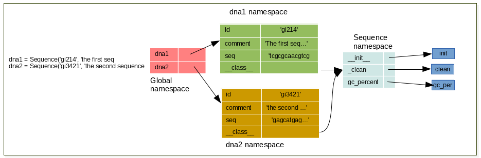

.. sectnum::
   :start: 13

.. _Object_Oriented_Programming:

***************************
Object Oriented Programming
***************************

Exercises
=========

Exercise
--------

Modelize a sequence with few attributes and methods

.. literalinclude:: _static/code/sequence.py
   :linenos:
   :language: python

:download:`sequence.py <_static/code/sequence.py>` .

Exercise
--------

Instanciate 2 sequences using your Sequence class, and draw schema representing the namespaces

.. container:: clearer

    .. image :: _static/figs/spacer.png

Exercise
--------

Can you explain this result (draw namespaces  to explain) ?
how to modify the class variable *class_attr*

.. literalinclude:: _static/code/class_attribute.py
   :linenos:
   :language: python

:download:`class_attribute.py <_static/code/class_attribute.py>` .

Exercise
--------

Write the definition of a Point class. Objects from this class should have a

    * a method **show** to display the coordinates of the point
    * a method **move** to change these coordinates.
    * a method **dist** that computes the distance between 2 points.

.. note::
    the distance between 2 points A(x0, y0) and B(x1, y1) can be compute

    .. math::
         d(AB) = \sqrt{(x1-x0))^2 + (y1-y0)^2}

    (http://www.mathwarehouse.com/algebra/distance_formula/index.php)

The following python code provides an example of the expected behaviour of objects belonging to this class: ::

    >>> p1 = Point(2, 3)
    >>> p2 = Point(3, 3)
    >>> p1.show()
    (2, 3)
    >>> p2.show()
    (3, 3)
    >>> p1.move(10, -10)
    >>> p1.show()
    (12, -7)
    >>> p2.show()
    (3, 3)
    >>> p1.dist(p2)
    1.0

.. literalinclude:: _static/code/point.py
   :linenos:
   :language: python

:download:`point.py <_static/code/point.py>` .

Exercise
--------

Use OOP to modelize restriction enzyme, and sequences.

the sequence must implement the following methods

    * enzyme_filter which take as a list of enzymes as argument and return a **new** list containing the enzymes which have
      binding site in sequence

the restriction enzyme must implements the following methods

    * binds which take a sequence as argument and return True if the sequence contains a binding site, False otherwise.

solve the exercise :ref:`enzyme_exercise` using this new implementation.

.. literalinclude:: _static/code/enzyme.py
   :linenos:
   :language: python

:download:`enzyme.py <_static/code/enzyme.py>` .

Exercise
--------

refactor your code of :ref:`matrix_exercise` in OOP style programming. implements only

 * **size**: return the number of rows, and number of columns
 * **get_cell**: that take the number of rows, the number of columns as parameters,
   and returns the content of cell corresponding to row number col number
 * **set_cell**: that take the number of rows, the number of columns as parameters, and a value
   and set the value val in cell specified by row number x column number
 * **to_str**: return a string representation of the matrix
 * **mult**: that take a scalar and return a new matrix which is the scalar product of matrix x val

you can change the name of the methods to be more pythonic

.. literalinclude:: _static/code/matrix_obj.py
   :linenos:
   :language: python

:download:`matrix_obj.py <_static/code/matrix_obj.py>` .

Exercise
--------

Use the code to read multiple sequences fasta file in procedural style and refactor it in OOP style.
use the file :download:`abcd.fasta <_static/data/abcd.fasta>` to test your code.

What is the benefit to use oop style instead of procedural style?

.. literalinclude:: _static/code/fasta_object.py
   :linenos:
   :language: python

:download:`fasta_object.py <_static/code/fasta_object.py>` .